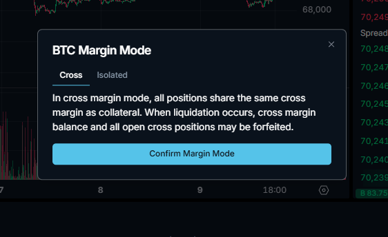

In cross margin mode, all positions share the same cross margin as collateral. When liquidation occurs, cross margin balance and all open cross positions may be forfeited.

Cross Margin
Cross margin utilizes your entire account balance to support all open positions.

Account Value Calculation:

Copy
account_value = account_cash_balance + pnl
Profit and Loss (PnL) for cross-margined positions update continuously as market prices fluctuate, excluding isolated margin positions.

Isolated Margin
Isolated margin assigns a dedicated margin amount to each individual position. 

Initial Margin Calculation
Regardless of margin mode, placing an order reserves initial margin based on your entry price, position size, selected leverage.

Copy
initial_margin = (position_size × entry_price / leverage)
Unrealized PnL and Withdrawable Balance.
Unrealised PnL can be withdrawn from isolated positions or cross-margined account account, but only if uPnL + account balance is at least 10% of the total notional position value of all open positions and meet the initial margin requirement:

withdrawable_balance = account_balance + unrealized_pnl - max(initial_margin_required, 0.1 * total_position_value)

Also, account_balance cannot be withdrawn past zero, regardless of uPnL.

API Documentation
API
REST API
Account
Update margin mode
This endpoint allows users to switch between isolated and cross margin modes for a specific trading pair. For open positions, users cannot change the margin mode.

Copy
POST /api/v1/account/margin
Operation Type (for signing)
Header Field
Type
Content
"type"

string

"update_margin_mode"

Request Body
Field
Type
Need
Description
Example
"account"

string

required

User's wallet address

42trU9A5...

"symbol"

string

required

Trading pair symbol

BTC

"is_isolated"

boolean

required

Margin mode (true for isolated, false for cross)

false

"timestamp"

integer

required

Current timestamp in milliseconds

1716200000000

"expiry_window"

integer

optional

Signature expiry in milliseconds

30000

"agent_wallet"

string

optional

Agent wallet address

69trU9A5...

"signature"

string

required

Cryptographic signature

5j1Vy9Uq...

Copy
{
  "account": "42trU9A5...",
  "symbol": "BTC",
  "is_isolated": false,
  "timestamp": 1716200000000,
  "expiry_window": 30000,
  "agent_wallet": "69trU9A5...",
  "signature": "5j1Vy9Uq..."
}
Response
Status 200: Margin mode updated successfully

Copy
 {
    "success": true
  }
Status 400: Invalid request parameters

Copy
  {
    "error": "Invalid margin mode",
    "code": 400
  }
Status 500: Internal server error

Code Example (Python)

Copy
import requests

payload = {
    "account": "42trU9A5...",
    "signature": "5j1Vy9Uq",
    "timestamp": 1716200000000,
    "symbol": "BTC",
    "is_isolated": false
}

response = requests.post(
    "/api/v1/account/margin",
    json=payload,
    headers={"Content-Type": "application/json"}
)

data = response.json()